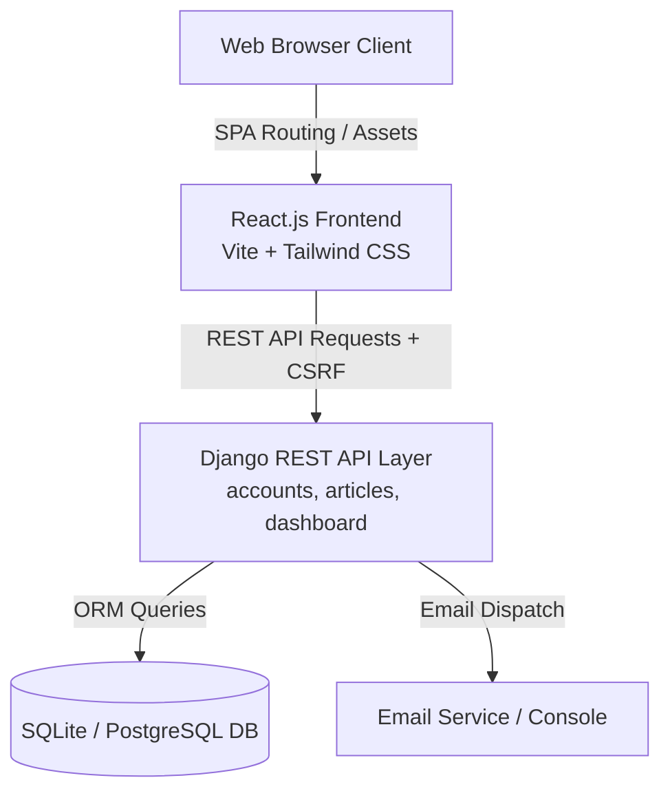

# ⚡ DevDocs — Modern Developer Documentation & Technical Publishing Platform

<div align="center">


<p align="center">
  <strong>DevDocs</strong> is an open-source, decoupled engineering publication and technical documentation platform. It pairs an authoritative <strong>Django REST Framework</strong> backend with a state-of-the-art <strong>React.js (Vite + Tailwind CSS)</strong> Single Page Application.
</p>

[Key Features](#-key-features) • [Architecture](#-system-architecture) • [Quickstart](#-getting-started) • [REST API](#-api-specification) • [Testing](#-running-tests) • [License](#-license)

</div>

---

## 🌟 Key Features

### 📰 Public Developer Portal
- **Interactive Single-Page Architecture**: Fast, client-side routing via React Router with zero full-page reload lag.
- **Architectural Documentation Engine**: Native rendering for **Mermaid.js** diagrams (flowcharts, sequence diagrams, class models, state machines) and **PrismJS** syntax-highlighted code blocks with one-click clipboard copying.
- **Rich Article Formatting**: Callout blocks (`:::note`, `:::tip`, `:::warning`, `:::danger`, `:::success`), sticky table of contents navigation, and dedicated 320px responsive horizontal scroll wrappers for tables and diagrams.
- **Community Interaction**: Live article appreciation (likes) with optimistic UI updates, threaded discussions with pinned staff responses, and developer newsletter subscriptions.
- **Category & Tag Filters**: Multi-tag filtering and full-text search indexing.
- **Persistent Theme System**: Dark/Light mode switcher with custom palette tokens.

### 🛠️ Administrative Control Center (Staff Only)
- **Role-Based Security**: Staff-gated access with session verification and SameSite CSRF protection.
- **Editorial Overview Dashboard**: Summary counters for Published, Scheduled, Draft, and Planned articles.
- **Engagement Performance Chart**: Responsive SVG visualization of article views, likes, and comments.
- **Single-Query Editorial Calendar**: Monthly date matrix with day cards and release badges.
- **Article Lifecycle Management**: Full CRUD editor supporting Markdown, cover thumbnail upload with live preview, and scheduled release date triggers.
- **Community Moderation**: Threaded comment moderation (pin/unpin, delete), registered user directory, and newsletter subscriber tracking.

### 🔐 Security & Identity
- **Two-Factor / Email OTP Authentication**: 6-digit verification code with 10-minute validity and 5-attempt rate limiting.
- **Strict CSRF & Session Security**: Django SameSite Lax cookies with `X-CSRFToken` request headers.
- **Authoritative Backend**: Django ORM remains the single source of truth for validation, authorization (`is_staff`, `IsAuthenticated`), and data persistence.

---

## 🏗️ System Architecture



### Decoupled Data Flow:
1. **Client Layer**: React.js SPA initialized with global state context providers (`AuthContext`, `ThemeContext`, `ToastContext`).
2. **API Communication**: Centralized `apiClient` manages requests, automatic CSRF token injection, and structured error handling.
3. **Backend Authority**: Django views enforce authentication, permission policies (`IsAdminUser`, `IsAuthenticated`), and execute database operations.

---

## 🚀 Getting Started

### Prerequisites
- **Python 3.11+**
- **Node.js 18+** and **npm**
- **Git**

---

### Step 1: Clone the Repository
```bash
git clone https://github.com/logicbyroshan/blog-website-react.git
cd blog-website-react
```

---

### Step 2: Backend Setup (Django REST API)

```bash
# Create and activate Python virtual environment
python -m venv venv

# Windows:
venv\Scripts\activate
# macOS/Linux:
source venv/bin/activate

# Install Python dependencies
pip install -r requirements.txt

# Run migrations
python manage.py migrate

# Create initial administrator user
python manage.py createsu

# Start Django Development Server (runs on port 8000)
python manage.py runserver 127.0.0.1:8000
```

---

### Step 3: Frontend Setup (React + Vite)

In a separate terminal window:

```bash
# Navigate to the frontend workspace
cd frontend

# Install Node dependencies
npm install

# Start Vite Development Server (runs on port 5173 with proxy to 8000)
npm run dev
```

- **Frontend Application**: `http://127.0.0.1:5173/`
- **Django REST API**: `http://127.0.0.1:8000/api/`
- **Django Superuser Admin**: `http://127.0.0.1:8000/django-admin/`

---

## 📡 API Specification

### Authentication (`/api/auth/`)
| Method | Endpoint | Description | Auth Required |
| :--- | :--- | :--- | :--- |
| `GET` | `/api/auth/csrf/` | Seed CSRF cookie for SPA session | No |
| `POST` | `/api/auth/signup/` | Register new user & trigger OTP email | No |
| `POST` | `/api/auth/verify-otp/` | Validate 6-digit code & activate account | No |
| `POST` | `/api/auth/resend-otp/` | Resend verification code (60s cooldown) | No |
| `POST` | `/api/auth/login/` | Start authenticated user session | No |
| `POST` | `/api/auth/logout/` | Terminate session | Yes |
| `GET` | `/api/auth/me/` | Current user profile & metrics | Yes |
| `PATCH` | `/api/auth/me/` | Update profile information | Yes |

### Public Content & Documentation (`/api/blog/`)
| Method | Endpoint | Description | Auth Required |
| :--- | :--- | :--- | :--- |
| `GET` | `/api/blog/home/` | Homepage aggregate (Hero, Trending, Latest) | No |
| `GET` | `/api/blog/posts/` | Filterable article archive (search & tags) | No |
| `GET` | `/api/blog/posts/<slug>/` | Full article detail, comments & related posts | No |
| `POST` | `/api/blog/posts/<slug>/appreciate/` | Toggle article like/appreciation | Yes |
| `POST` | `/api/blog/posts/<slug>/comments/` | Submit new discussion comment | Yes |
| `GET` | `/api/blog/categories/` | Category tags list with article counts | No |
| `POST` | `/api/blog/subscribe/` | Newsletter email subscription | No |
| `GET` | `/api/blog/about/` | Author bio, tech stack & metrics | No |
| `GET` | `/api/blog/docs/` | Technical documentation catalog | No |
| `GET` | `/api/blog/docs/<slug>/` | Technical blueprint detail & Mermaid data | No |

### Admin Control Center (`/api/admin/`)
| Method | Endpoint | Description | Auth Required |
| :--- | :--- | :--- | :--- |
| `GET` | `/api/admin/dashboard/` | Overview metrics, calendar matrix, chart | Staff (`is_staff`) |
| `GET` | `/api/admin/posts/` | Post management list with status filters | Staff (`is_staff`) |
| `POST` | `/api/admin/posts/` | Create article with thumbnail upload | Staff (`is_staff`) |
| `GET` | `/api/admin/posts/<id>/` | Fetch article data for editor | Staff (`is_staff`) |
| `PATCH` | `/api/admin/posts/<id>/` | Update article fields & thumbnail | Staff (`is_staff`) |
| `DELETE` | `/api/admin/posts/<id>/` | Delete article permanently | Staff (`is_staff`) |
| `POST` | `/api/admin/posts/<id>/toggle-active/` | Toggle visibility active/hidden | Staff (`is_staff`) |
| `POST` | `/api/admin/posts/<id>/toggle-recommend/` | Toggle recommended spotlight | Staff (`is_staff`) |
| `POST` | `/api/admin/posts/plan/` | Quick idea planner intake | Staff (`is_staff`) |
| `GET` | `/api/admin/activity/` | Community metrics, users & comments | Staff (`is_staff`) |
| `POST` | `/api/admin/comments/<id>/toggle-pin/` | Pin/unpin comment | Staff (`is_staff`) |
| `DELETE` | `/api/admin/comments/<id>/` | Delete comment | Staff (`is_staff`) |

---

## 🧪 Running Tests

### Automated Backend Tests (34/34 passing)
```bash
python manage.py test
```

### Production Frontend Build Verification
```bash
cd frontend
npm run build
```

---

## 📂 Repository Structure

```text
├── accounts/                   # User authentication, OTP verification & profile management
│   ├── api/                    # DRF serializers, views, and routes for auth
│   ├── models.py               # Custom user helpers
│   └── tests.py                # Auth automated unit test suite
├── articles/                   # Public technical articles, documentation blueprints, tags, comments
│   ├── api/                    # DRF serializers, views, and routes for content & docs
│   ├── models.py               # Post, Tag, Comment, NewsletterSubscriber models
│   └── tests.py                # Public content automated unit test suite
├── dashboard/                  # Staff editorial control center, calendar & moderation
│   ├── api/                    # DRF serializers, views, and routes for admin panel
│   └── tests.py                # Admin control automated unit test suite
├── config/                     # Django project settings, CORS & root URL routing
│   ├── settings.py             # DRF, CORS, Database, Static/Media configuration
│   ├── urls.py                 # Root URL configuration & SPA fallback
│   └── views.py                # SPA index view
├── frontend/                   # React.js + Tailwind CSS Single Page Application
│   ├── src/
│   │   ├── api/                # Client API layer (auth, blog, admin, docs)
│   │   ├── components/         # UI primitives, DataTable, CodeBlock, Mermaid, Charts
│   │   ├── contexts/           # AuthContext, ThemeContext, ToastContext
│   │   ├── layouts/            # MainLayout, AdminLayout, AuthLayout
│   │   └── pages/              # Home, Articles, Detail, Docs, Admin, Auth
│   ├── index.html              # Typography & root HTML
│   ├── tailwind.config.js      # Design tokens & color surfaces
│   └── vite.config.js          # Vite config & dev server proxy
├── FRONTEND_MIGRATION.md       # Full architecture migration audit log
├── build.sh                    # Deployment build script (npm build + collectstatic + migrate)
├── requirements.txt            # Python dependencies
└── manage.py                   # Django management executable
```

---

## 📄 License
This project is licensed under the [MIT License](LICENSE).